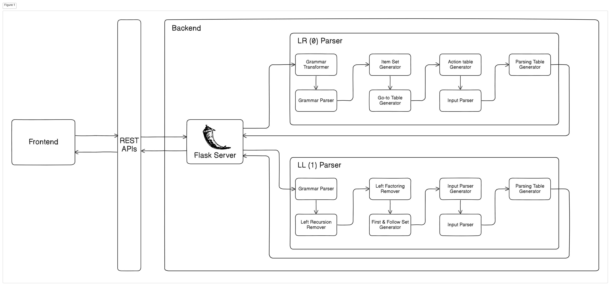

# ParseLoom

ParseLoom is a comprehensive web-based educational tool designed for visualizing and understanding parser generation and parsing processes. It supports both LR(0) and LL(1) parsing algorithms, providing students and developers with an interactive platform to explore fundamental concepts in compiler design and formal language theory.

## Overview

ParseLoom offers a complete learning environment for parser construction and analysis, featuring:

- Interactive grammar input and validation for context-free grammars
- Dual parser implementation supporting both LR(0) and LL(1) algorithms
- Visual representation of parsing automata and item sets
- Automatic generation of parsing tables (ACTION/GOTO for LR(0), parsing table for LL(1))
- Step-by-step parsing simulation with detailed trace information
- Real-time error detection and comprehensive feedback
- Modern web interface built with responsive design principles

The system architecture separates concerns through a Flask-based backend that handles the computational complexity of parser generation and a clean frontend interface that provides intuitive visualizations and user interactions.

## Features

### Core Functionality
- **Grammar Processing**: Support for context-free grammar input in standard BNF notation
- **Dual Parser Support**: Implementation of both LR(0) and LL(1) parsing algorithms
- **Interactive Parsing**: Real-time parsing simulation with input string validation
- **Educational Visualizations**: Clear representation of parsing states and transitions
- **Error Analysis**: Detailed error reporting for both grammar validation and parsing failures

### LR(0) Parser Features
- Construction and visualization of LR(0) item sets
- Automatic generation of ACTION and GOTO tables
- Detection of shift-reduce and reduce-reduce conflicts
- Step-by-step bottom-up parsing simulation

### LL(1) Parser Features
- Computation of FIRST and FOLLOW sets
- LL(1) parsing table construction
- Left-recursion and Left-factoring detection and automatic removal
- Top-down parsing simulation with predictive analysis

## Architecture


## Installation and Setup

### Prerequisites
- Python 3.8 or higher
- Modern web browser (Chrome, Firefox, Safari, or Edge)

### Backend Setup
1. Clone the repository and navigate to the project directory:
   ```bash
   cd ParseLoom
   ```

2. Install the required Python dependencies:
   ```bash
   pip install -r requirements.txt
   ```

3. Start the Flask backend server:
   ```bash
   cd backend
   python app.py
   ```

   The backend server will start on `http://localhost:5000` by default.

### Frontend Setup
1. Navigate to the frontend directory:
   ```bash
   cd frontend
   ```

2. Open `index.html` in a web browser, or serve the files using a local web server:

## Usage Guide

### Grammar Input Format
Enter context-free grammar productions using the following format:
```
S -> ( S ) | id
E -> E + T | T
T -> T * F | F
F -> ( E ) | id
```

## Educational Context

ParseLoom is designed as an educational tool for understanding:

- **Compiler Design Fundamentals**: How parsers fit into the compilation process
- **Formal Language Theory**: Context-free grammars and their properties
- **Parsing Algorithms**: Differences between top-down (LL) and bottom-up (LR) approaches
- **Conflict Resolution**: Understanding and resolving parsing conflicts
- **Table-Driven Parsing**: How parsing tables drive the parsing process

## Technical Notes

- The backend uses Flask with CORS enabled for cross-origin requests
- Parsing algorithms are implemented from scratch for educational clarity
- The frontend uses vanilla JavaScript for broad compatibility
- Error handling provides detailed feedback for debugging grammar issues

## Disclamer
ParseLoom may produce errors. Always verify the result.
